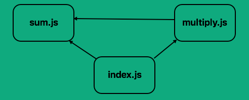
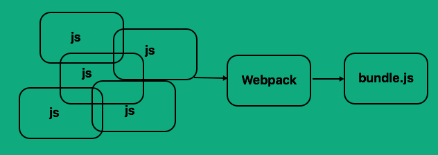

해당 글은 
[Webpack tutorial](https://medium.com/ag-grid/webpack-tutorial-understanding-how-it-works-f73dfa164f01) 번역한 글입니다.

웹팩은 모듈 번들러입니다.  
서로 다른 의존성을 취하고 이를 위한 모듈을 생성하며 전체 네트워크를 관리 가능한 출력 파일로 묶습니다. 이는 오늘날 웹 응용 프로그램의 단일 페이지 응용 프로그램(SPA)에 유용합니다.

예를 들어 합과 곱하기라는 두 가지 간단한 수학적 작업을 수행 할 수 있는 응용 프로그램이 있다고 가정 해 봅시다. 우리는 유지 보수를 쉽게 하기 위해 이 기능들을 별도의 파일로 나누기로 결정했습니다.

``` html
<html>
<head>
  <script src="src/sum.js"></script>
  <script src="src/multiply.js"></script>
  <script src="src/index.js"></script>
</head>
</html>
```

``` javascript
// index.js
var totalMultiply = multiply(5, 3);
var totalSum = sum(5, 3);
console.log('Product of 5 and 3 = ' + totalMultiply);
console.log('Sum of 5 and 3 = ' + totalSum);

// multiply.js
var multiply = function (a, b) {
  var total = 0;
  for (var i = 0; i < b; i++) {
    total = sum(a, total);
  }
  return total;
};

// sum.js
var sum = function (a, b) {
  return a + b;
};
```

위 코드에서 multiply.js와 index.js가 sum.js에 의존한다는 것을 알 수 있습니다.  
의존성 다이어그램을 간단한 다이어그램으로 표시 할 수 있습니다.  



index.html에서 js 파일의 순서를 잘못 넣었다면 응용 프로그램이 작동하지 않습니다.  
index.js가 다른 2가지(multiply.js, sum.js)파일보다 먼저 실행되면 오류가 발생 될 것입니다.


##### webpack 주요 기능
index.html을 살펴보면 3개의 js파일을 다운로드 해야 된다는 것을 알 수 있습니다.  
몇개 안되는 파일을 받는 것은 괜찮겠지만, 수많은 파일을 받을 때는 상당한 시간이 소요될 것 입니다.
webpack 제공하는 주요 기능은 번들링입니다.  
webpack은 모든 의존성을 단일 파일로 가져올 수 있으므로 하나의 의존성 파일만 다운로드하면 됩니다.



번들링 및 모듈화는 webpack의 주요 기능입니다.  
플러그인과 로더를 통해 더 확장 가능하지만, 이것이 webpack의 주요 기능입니다.

##### 의존성을 가능하게 연결
초기 설정에는 CommonJS 모듈 구문을 사용합니다. 다른 옵션 (AMD, ES2015)이 있지만 지금은 CommonJS를 사용하고 나중에 ES2015로 이동합니다.  
CommonJS는 module.exports함수 또는 변수를 다른 코드로 내보내거나 사용 가능하게 하는 데 사용합니다. 그런 require 다음 내 보낸 값을 가져옵니다.

``` html
<html>
<head>
    <script src="./dist/bundle.js""></script>
</head>
</html>
```

``` javascript
// index.js
var multiply = require('./multiply');
var sum = require('./sum');
var totalMultiply = multiply(5, 3);
var totalSum = sum(5, 3);
console.log('Product of 5 and 3 = ' + totalMultiply);
console.log('Sum of 5 and 3 = ' + totalSum);

// multiply.js
var sum = require('./sum');
var multiply = function (a, b) {
  var total = 0;
  for (var i = 0; i < b; i++) {
    total = sum(a, total);
  }
  return total;
};
module.exports = multiply;

// sum.js
var sum = function (a, b) {
  return a + b;
};
module.exports = sum;
```

sum, multiply 이 2개를 다른 코드에서 사용 가능 하도록 만들었습니다. 그리고 multiple.js, index.js에서 노출된 함수들을 쓸 수 있습니다.

그리고 index.html에서는 bundle.js이라는 파일을 가져왔습니다.

더 이상 의존성의 순서에 대해 걱정 할 필요가 없어졌습니다. 원하는 것을 노출 시켰고, 다른 코드를 비공개로 유지할 수 있습니다. 또한 웹 호출을 3개(sum.js, multiply.js, index.js)에서 단일 호출로 줄임으로써 로드 시간을 단축하는데 도움이 됩니다.

##### 웹팩 초기 구성
위의 작업을 수행하려면 초기 웹팩 구성을 수행 해야 합니다.

```javascript
var path = require('path');
module.exports = {
  entry: './src/index.js',
  output: {
    path: path.resolve(__dirname, './dist/),
    filename: 'bundle.js
  }
}
```
Webpack에 응용 프로그램 진입과 결과 출력이 무엇인지 알려줘야 합니다.  

`entry`: 이것은 우리 응용 프로그램의 주요 진입점입니다. 우리의 초기 로딩 및 어플리케이션 로직이 있는 곳입니다. webkpack은 이를 종속성 트리 보행의 시작점으로 사용합니다. 종속성 그래프를 작성하고 필요에 따라 모듈을 작성합니다.

`output.path`: 결과 번들의 절대 경로입니다. 이 크로스 플랫폼을 사용하고 쉽게 사용할 수 있도록 내장 Node.js 함수 ( `path`)를 사용합니다. 이를 통해 현재 위치를 기준으로 절대 경로를 동적으로 만들 수 있습니다.

`output.filename`: 결과 번들의 파일 이름입니다. 이것은 무엇이든 가능하지만 일반적으로 'bundle.js'라고합니다.

참고 : `__dirname` Node.js 유틸리티 변수-현재 파일의 디렉토리 이름입니다.

---

##### 참고사이트
[Webpack](https://webpack.js.org/)  
[Webpack tutorial](https://medium.com/ag-grid/webpack-tutorial-understanding-how-it-works-f73dfa164f01)